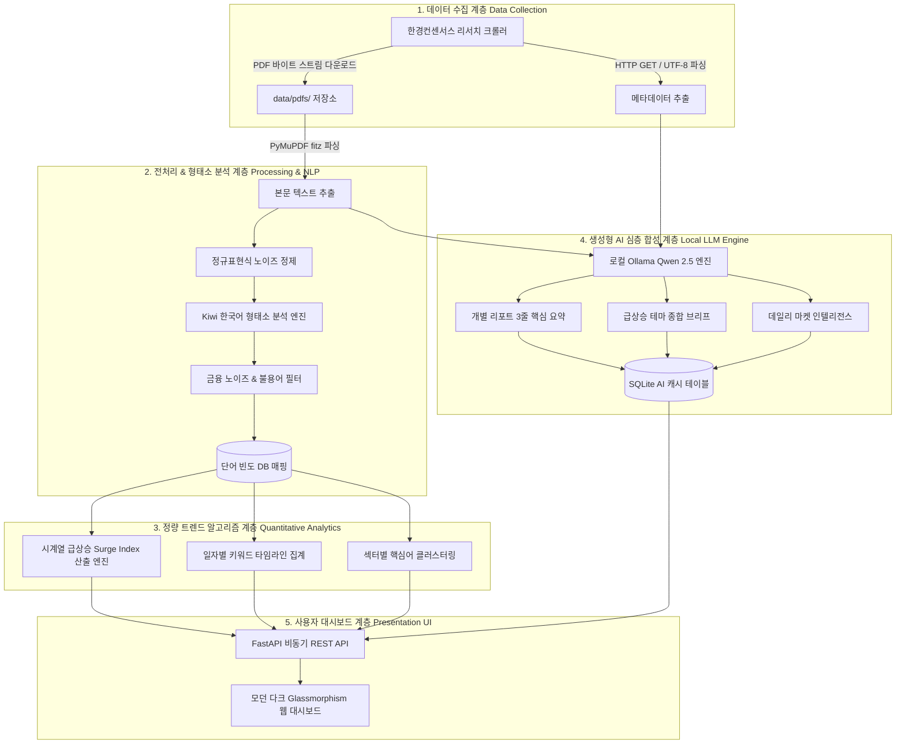
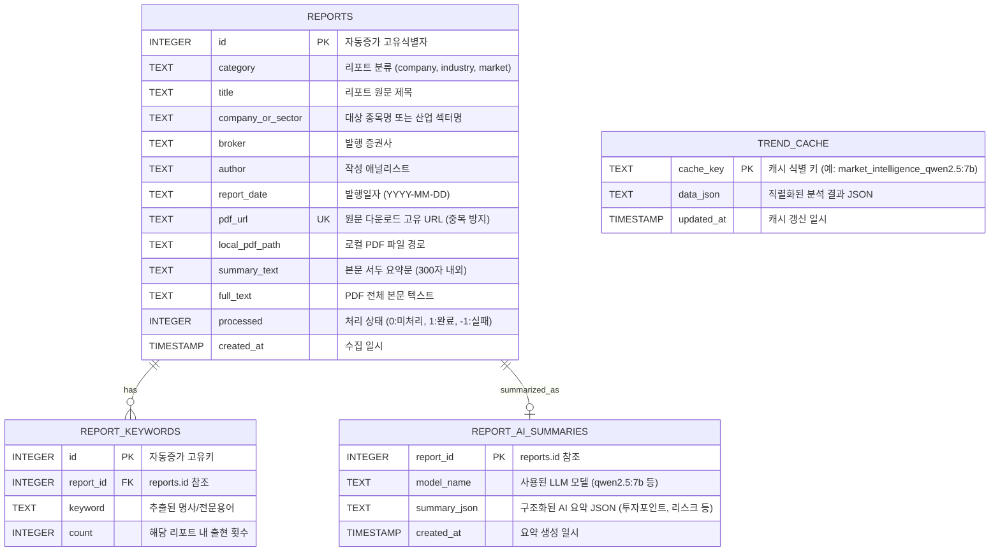

# 01. 전체 시스템 아키텍처 및 데이터 흐름 설계서

본 문서는 **주식/산업 리포트 트렌드 인텔리전스 시스템**의 전반적인 구조, 데이터 라이프사이클, 모듈 간 상호작용 및 데이터베이스 설계를 상세히 기술합니다.

---

## 1. 시스템 전체 아키텍처 (System Architecture)

본 시스템은 **데이터 수집(Data Ingestion) ➔ 전처리 및 NLP(Text & NLP Processing) ➔ 정량적 트렌드 분석(Trend Analytics) ➔ 생성형 AI 심층 합성(LLM Synthesis) ➔ 시각화 대시보드(Presentation)**의 5단계 파이프라인으로 구성됩니다.

---

## 2. 데이터베이스 스키마 설계 (SQLite Database Design)

데이터 저장은 영구성, 단일 파일 배포 용이성, 고속 인덱싱 성능을 고려하여 **SQLite (`data/reports.db`)**를 사용합니다.

---

## 3. 핵심 설계 원칙 (Design Principles)

1. **멱등성(Idempotency) 및 증분 수집(Incremental Ingestion)**
   - `reports.pdf_url`을 유니크 키로 지정하여, 크롤러를 여러 번 실행해도 이미 존재하는 리포트는 건너뛰고 새롭게 발행된 리포트만 다운로드/분석합니다.
2. **다계층 캐싱 전략 (Multi-Layer Caching)**
   - **PDF 텍스트 캐싱**: 한 번 다운로드 및 추출된 텍스트는 DB와 로컬 파일에 캐싱되어 재파싱 비용 제로화.
   - **키워드 사전 집계 캐싱**: `report_keywords` 테이블에 단어 출현 빈도를 사전에 인덱싱하여 트렌드 계산 속도를 $O(1) \sim O(\log N)$으로 단축.
   - **LLM 추론 결과 캐싱**: LLM 요약 결과를 `report_ai_summaries` 및 `trend_cache`에 영구 보관하여 중복 요청 시 0초 즉시 반환.
3. **완전 로컬/프라이빗 운영 (Zero External Dependency)**
   - 외부 유료 API나 클라우드 의존성 없이, 사용자 로컬 GPU(RTX 3060 12GB)와 Ollama를 통해 모든 AI 기능이 오프라인 상태에서도 100% 동작합니다.
