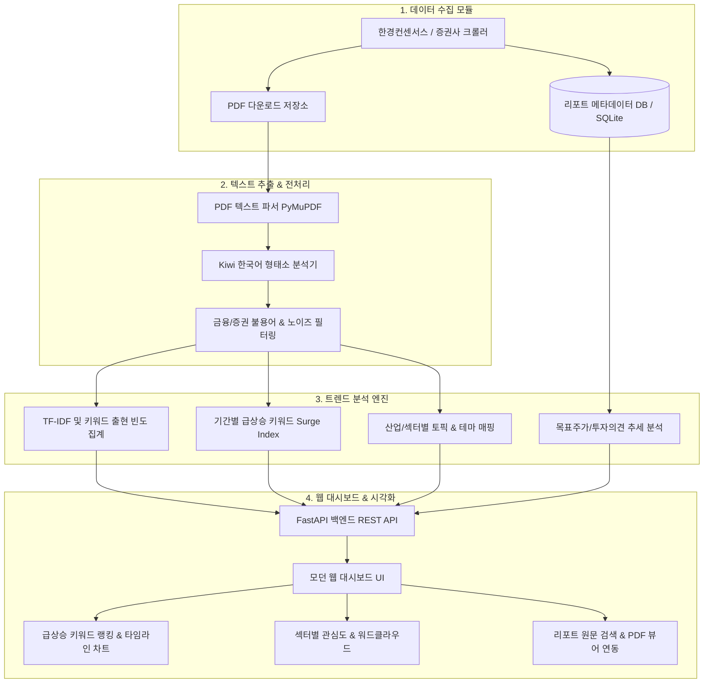

# 주식/산업 리포트 크롤링 및 트렌드 분석 시스템 구현 계획서

증권사 및 산업 리포트를 자동으로 수집하여 PDF 본문 텍스트를 추출하고, 한국어 형태소 분석(`Kiwi`) 및 TF-IDF/급상승 지수를 통해 시장의 핵심 키워드, 섹터별 관심도, 테마 트렌드를 시각화하는 통합 분석 플랫폼 구축 계획입니다.

---

## 1. 시스템 아키텍처 & 워크플로우



---

## 2. 주요 구성 모듈

1. **리포트 수집 엔진 (`crawler/report_crawler.py`)**
   - 기업 분석(`business`), 산업 분석(`industry`), 시장/시황 분석(`market`) 리포트 수집
   - 작성일, 제목, 대상 종목/섹터, 증권사, 애널리스트, 첨부 PDF 원문 링크 파싱
   - SQLite DB 중복 방지 및 증분(Incremental) 수집

2. **텍스트 추출 및 전처리 (`processor/`)**
   - **`pdf_parser.py`**: `PyMuPDF (fitz)` 기반 고속 PDF 텍스트 추출 및 본문 서두 요약문 생성
   - **`nlp_engine.py`**: `kiwipiepy`(Kiwi) 기반 한국어 명사(`NNG`, `NNP`) 및 전문 축약어(`SL`) 추출
   - 금융 특화 불용어 및 리포트 서식 노이즈(증권사명, 면책조항 등) 자동 필터링

3. **트렌드 분석 엔진 (`analyzer/trend_analyzer.py`)**
   - **전체 빈출 키워드 집계**: 시장 전반의 핵심 관심 단어 추출 (워드클라우드/차트 연동)
   - **급상승(Surge) 스코어 산출**: 이전 기간 대비 최근 출현 빈도가 급증한 테마/종목 발굴
   - **일자별 타임라인 분석**: 주요 키워드의 일별 언급 빈도 시계열 추이
   - **섹터별 키워드 매핑**: 산업군/종목별 대표 키워드 군집화

4. **웹 대시보드 (`app/`)**
   - **FastAPI 백엔드 REST API** (`app/main.py`)
   - **프리미엄 Glassmorphism 다크 테마 UI** (`app/static/`)
   - Chart.js (시계열 차트), WordCloud2.js (워드클라우드), 인터랙티브 리포트 탐색기

---

## 3. 실행 및 사용법

### 1) 패키지 설치
```bash
pip install -r requirements.txt
```

### 2) 웹 대시보드 서버 구동
```bash
python main.py --server-only --port 8000
```
브라우저에서 `http://localhost:8000`에 접속합니다.

### 3) CLI 일괄 파이프라인 실행
```bash
# 카테고리당 3페이지 수집 및 50건 PDF 분석
python main.py --crawl-only --pages 3 --max-pdfs 50
```
